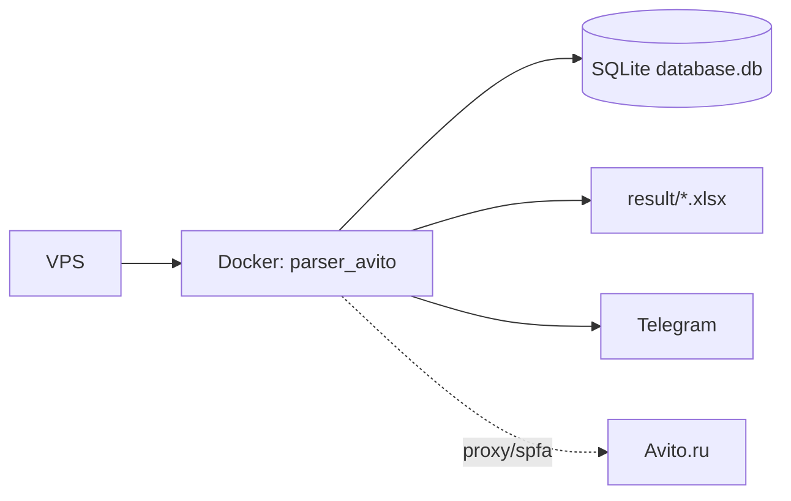
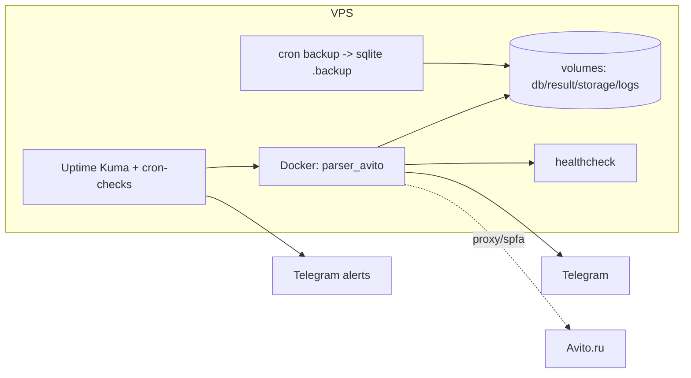
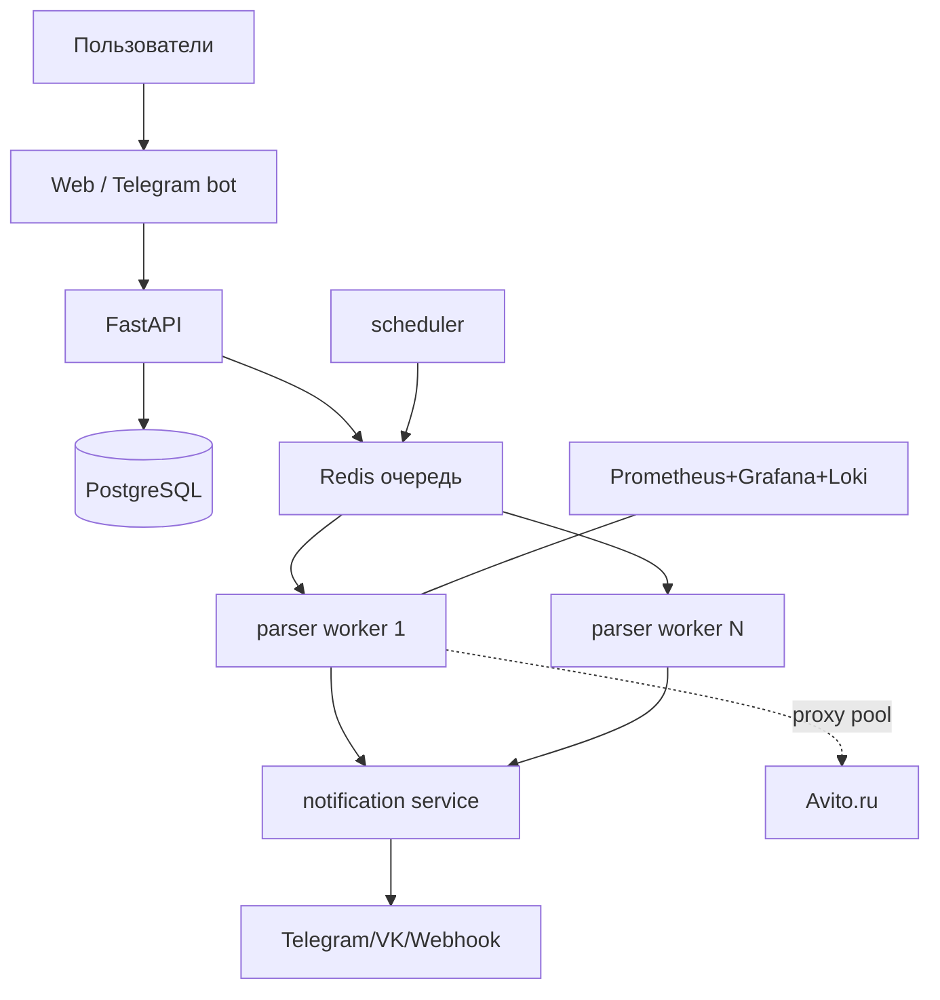

# DEPLOYMENT_OPTIONS — Варианты архитектуры развёртывания

> Статус: предварительно (финальный выбор — после ответов на `SERVER_QUESTIONNAIRE.md`).
> Ниже три варианта от минимального к масштабируемому + рекомендация.

---

## Вариант 1 — Минимальный (личное использование)

**Состав:** один VPS → один Docker-контейнер (`parser_cls.py`) → SQLite + Excel → Telegram.
Несколько ссылок, ручное обновление, простые backups (cron + `sqlite3 .backup`).

| Параметр | Значение |
|---|---|
| Требования к серверу | 1 vCPU, 1 ГБ RAM, 10–20 ГБ диск, amd64/arm64 |
| Сложность | Низкая |
| Риски | блокировки Avito; потеря данных при сбое (#300); ручное обновление |
| Плюсы | дёшево, быстро, просто |
| Минусы | нет HA, минимум мониторинга, один пользователь |
| Стоимость инфраструктуры | VPS ~150–400 ₽/мес + прокси/spfa (~120–2500 ₽/мес) |
| Масштабирование | низкое |

## Вариант 2 — Надёжный (постоянная эксплуатация) ⭐

**Состав:** Docker Compose (production), закреплённая версия (локальная сборка из commit/tag),
отдельные volumes (config/database/result/storage/logs), healthcheck, `restart: unless-stopped`,
лимиты ресурсов, ротация логов, backup по cron, мониторинг (Uptime Kuma + Telegram-alert),
staging перед обновлением, уведомления об ошибках.

| Параметр | Значение |
|---|---|
| Требования к серверу | 1–2 vCPU, 2 ГБ RAM, 20–40 ГБ диск |
| Сложность | Средняя |
| Риски | блокировки (митигируются прокси+spfa); регрессии при обновлении (митигируются staging) |
| Плюсы | устойчивость, наблюдаемость, безопасные обновления, бэкапы |
| Минусы | чуть дороже и сложнее в настройке |
| Стоимость | VPS ~300–700 ₽/мес + прокси/spfa |
| Масштабирование | среднее (вертикальное) |

> Для этого варианта потребуется production-`docker-compose.yml` (volumes для logs/storage,
> healthcheck, init, лимиты, ротация логов) + фиксы из `IMPROVEMENT_ROADMAP.md` P0/P1.

## Вариант 3 — Масштабируемый сервис (несколько пользователей)

**Состав:** Frontend + Backend API (FastAPI) + PostgreSQL + Redis + очередь (Celery/RQ) +
scheduler + parser-workers + notification service + Telegram-бот + admin-panel + auth + тарифы/лимиты +
мониторинг (Prometheus/Grafana/Loki) + централизованные логи.

| Параметр | Значение |
|---|---|
| Требования к серверу | от 4 vCPU / 8 ГБ RAM (или несколько узлов), 80+ ГБ диск |
| Сложность | Высокая |
| Риски | существенная переработка кода; антибот на масштабе; эксплуатационная сложность |
| Плюсы | мультиарендность, тарифы, аналитика, горизонтальное масштабирование |
| Минусы | дорого, долго, нужна команда/поддержка |
| Стоимость | от нескольких тысяч ₽/мес (серверы + пул прокси + сервисы) |
| Масштабирование | высокое (горизонтальное) |

**Что переиспользуется из текущего проекта:** HTTP-клиент, модели (`Item`), фильтры, нотификаторы,
экспорт, cookies/proxy-провайдеры. **Что переписывается:** бесконечный цикл → scheduler+queue,
локальный `config.toml` → БД настроек на пользователя, SQLite → PostgreSQL, глобальное состояние →
мультиарендность, биллинг/лимиты. Подробно — в `FINAL_REPORT.md`/§26 промта (после выбора).

---

## Предварительная рекомендация
- Для **личного/небольшого** сценария — **Вариант 2 (Надёжный)**: это «золотая середина» —
  немного сложнее минимального, но даёт устойчивость 24/7, бэкапы и мониторинг, что критично
  с учётом блокировок Avito и риска потери данных (#300).
- **Вариант 3** — только если цель действительно коммерческий мультипользовательский сервис
  (тогда основной объём работы — не развёртывание, а переработка по `IMPROVEMENT_ROADMAP.md` P2/P3).

> Финальная рекомендация будет уточнена после ответов на опросник.
