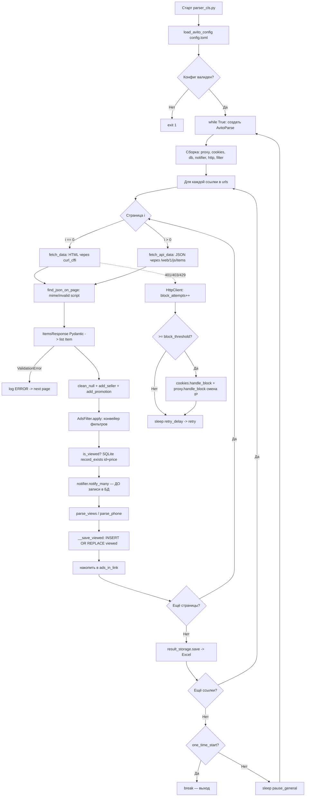

# HOW_IT_WORKS — Как работает проект (простым языком)

> Статус: **Подтверждено кодом**. Диаграмма построена по реальному коду `parser_cls.py`.

## 1. Что это такое

**Avito Parser** — это **настольное приложение / скрипт** (НЕ библиотека и НЕ веб-сервис), который
автоматически следит за новыми объявлениями на Avito.ru по заданным ссылкам и присылает
уведомления в Telegram и/или VK, а также складывает результаты в Excel.

- **Тип:** монолитное Python-приложение с двумя точками входа (GUI и CLI).
- **Для чего:** мониторинг новых объявлений «в реальном времени» (раньше других увидеть выгодное предложение).
- **Кому полезно:** перекупам/продавцам, аналитикам цен, тем, кто ищет конкретный товар по выгодной цене.
- **Что на выходе:** push-уведомление (TG/VK) с ценой, заголовком, фото и ссылкой + строка в Excel-файле.

## 2. Общий процесс работы (пошагово, по коду)

Точка входа сервера — `parser_cls.py` (блок `if __name__ == "__main__"`):

1. **Загрузка конфига** — `load_avito_config("config.toml")` → объект `AvitoConfig`. Если конфиг битый — выход с кодом 1.
2. **Бесконечный цикл** `while True`:
   - создаётся `AvitoParse(config)`;
   - вызывается `parser.parse()`;
   - если `one_time_start=True` — выход из цикла после первого прохода;
   - иначе пауза `pause_general` секунд и повтор;
   - при любом исключении — лог + пауза 30 с + повтор (цикл не падает).

Внутри `AvitoParse.__init__` собираются зависимости (через фабрики):
прокси (`build_proxy`), cookies (`build_cookies_provider`), БД (`SQLiteDBHandler`),
нотификатор (`build_notifier`), HTTP-клиент (`HttpClient`), фильтр (`AdsFilter`).
Конфиг логируется в замаскированном виде (`log_config`).

Внутри `parse()` для **каждой ссылки** из `config.urls`:

3. **Запрос 1-й страницы** — `fetch_data(url)` → HTML через `curl_cffi` (со случайной «личиной» браузера).
4. **Извлечение JSON** — `find_json_on_page()` достаёт встроенный в HTML JSON из тега
   `<script type="mime/invalid" data-mfe-state="true">` и берёт `state.data`.
5. **Параметры пагинации** — из `searchCore` формируются `api_params` и `context`
   (`build_api_params`), чтобы страницы 2..N тянуть уже через API `/web/1/js/items`.
6. **Преобразование в модели** — `ItemsResponse(**catalog)` (Pydantic) → список `Item`.
   При ошибке валидации — лог `ERROR` и переход к следующей странице.
7. **Обогащение** — `_clean_null_ads` (отбросить без id) → `_add_seller_to_ads`
   (вытащить slug продавца) → `_add_promotion_to_ads` (флаг «Продвинуто»).
8. **Фильтрация** — `filter_ads()` → `AdsFilter.apply()`: конвейер фильтров (см. §6 диаграммы).
   Первым в конвейере идёт фильтр «уже просмотренные» (запрос к SQLite).
9. **Уведомления** — `self.notifier.notify_many(filter_ads)` — **отправляются ДО сохранения в БД** ⚠️.
10. **Просмотры/телефоны** — `parse_views` (если включено), `parse_phone` (отключено).
11. **Запись «просмотрено»** — `__save_viewed()` → `INSERT OR REPLACE INTO viewed`.
12. **Накопление** — отфильтрованные объявления копятся в `ads_in_link`.
13. **Сохранение результата** — после всех страниц ссылки: `result_storage.save(ads_in_link)` → Excel.
14. **Обработка ошибок запроса** — внутри `HttpClient.request`: при 401/403/429 счётчик блокировок;
    по достижении `block_threshold` → `cookies.handle_block()` + `proxy.handle_block()` (смена IP),
    пауза `retry_delay`, повтор до `max_count_of_retry`. При исчерпании — `RuntimeError`,
    который ловится в `fetch_data` (для 1-й страницы) и логируется как warning.
15. **Следующий цикл** — после всех ссылок: лог статистики (хорошие/плохие запросы),
    пауза `pause_general`, новый проход.

> ⚠️ **Критический нюанс порядка операций (Issue #300):** уведомление (шаг 9) и запись «просмотрено»
> (шаг 11) происходят **до** записи результата в Excel (шаг 13). Если процесс упадёт между
> шагом 11 и 13 — объявление уже помечено просмотренным, но в Excel не попало → **потеря данных**.
> Подробнее: `KNOWN_ISSUES.md`, `IMPROVEMENT_ROADMAP.md` (P0).

## 3. Диаграмма процесса (по реальному коду)

## 4. Режимы запуска

### 4.1. GUI (`python AvitoParser.py`)
- **Кому:** новичкам, локальная настройка на Windows/desktop.
- **Плюсы:** наглядно, кнопки «Проверить TG/VK», логин в аккаунт через браузер.
- **Минусы:** требует графической среды; **не подходит для headless-VPS**.
- **Зависимости:** все, включая `flet`, `playwright` (+Chromium для логина).
- **Управление:** окно Flet, кнопки Старт/Стоп.
- **Пригодность для VPS:** ❌ низкая.

### 4.2. CLI / сервер (`python parser_cls.py`)
- **Кому:** для VPS, фоновой работы 24/7.
- **Плюсы:** без GUI, минимум ресурсов, легко в Docker/systemd.
- **Минусы:** настройка только через `config.toml` (нет интерактива); логин в аккаунт недоступен (нужен headed-браузер).
- **Зависимости:** GUI (`flet`) формально импортируется не нужен для `parser_cls`, но `requirements.txt` ставит всё.
- **Управление:** запуск/останов процесса (systemd/Docker/screen).
- **Пригодность для VPS:** ✅ высокая. **Рекомендуемый режим для сервера.**

### 4.3. Docker (`docker-compose up -d` / `entrypoint.sh`)
- **Кому:** для стабильной круглосуточной работы на VPS.
- **Плюсы:** изоляция, авто-рестарт (`restart: always`), воспроизводимость.
- **Минусы:** официальный образ `latest` устарел (#293) → нужна локальная сборка; запуск от root; нет healthcheck.
- **Зависимости:** Docker (+ compose).
- **Управление:** `docker compose`, `make`.
- **Пригодность для VPS:** ✅ высокая (с локальной сборкой). См. `DOCKER_AUDIT.md`.

### 4.4. Одноразовый запуск (`one_time_start=true`)
- Один проход по всем ссылкам и выход (+финальное уведомление «Парсинг завершён»).
- **Кому:** разовый сбор, запуск по cron.
- **Пригодность для VPS:** ✅ (как cron-job).

### 4.5. Постоянный фоновый мониторинг (`one_time_start=false`, по умолчанию)
- Бесконечный цикл с паузой `pause_general` между проходами.
- **Кому:** основной сценарий «следить и уведомлять».
- **Пригодность для VPS:** ✅ (основной режим, под Docker/systemd).
